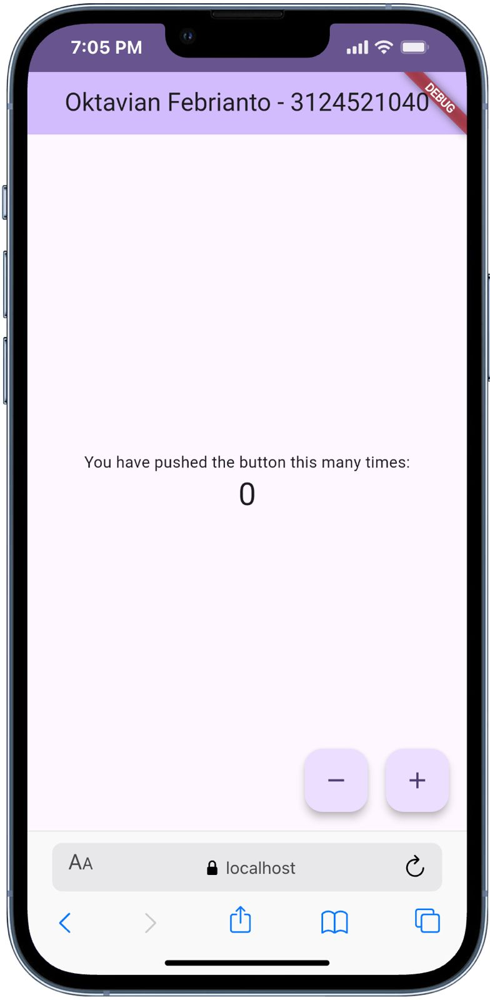
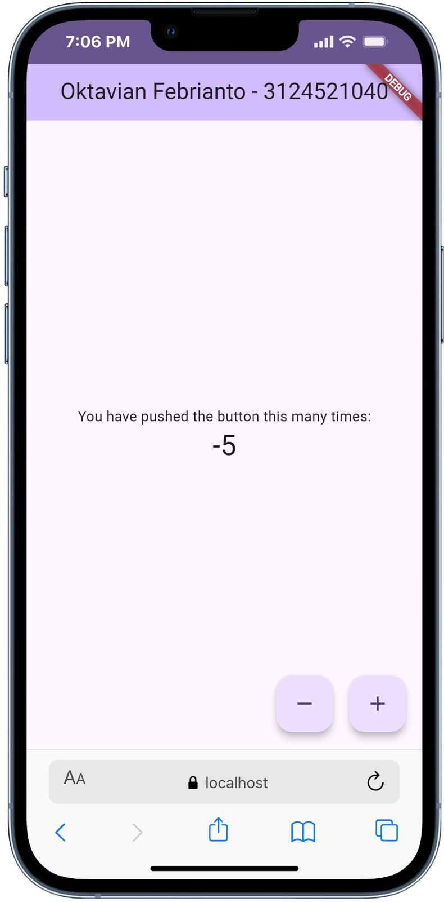

# Praktikum Flutter

**Nama:** Oktavian Febrianto  
**NRP:** 3124521040

---

## Laporan Praktikum

### Deskripsi Proyek

Proyek Flutter sederhana berupa aplikasi counter yang menampilkan jumlah klik pada tombol.

### Perubahan yang Dilakukan

#### 1. Mengubah Judul Aplikasi

Judul pada AppBar diubah dari `"Flutter Demo Home Page"` menjadi `"Oktavian Febrianto - 3124521040"` agar menampilkan identitas mahasiswa.

**Kode yang diubah (`lib/main.dart`):**

```dart
home: const MyHomePage(title: 'Oktavian Febrianto - 3124521040'),
```

#### 2. Menambahkan Tombol Decrement

Menambahkan tombol Floating Action Button baru dengan ikon minus (`Icons.remove`) untuk mengurangi nilai counter. Sebelumnya hanya terdapat satu tombol increment, sekarang terdapat dua tombol yang disusun secara horizontal menggunakan widget `Row`.

**Method `_decrementCounter` yang ditambahkan:**

```dart
void _decrementCounter() {
  setState(() {
    _counter--;
  });
}
```

**Tampilan dua tombol FAB:**

```dart
floatingActionButton: Row(
  mainAxisAlignment: MainAxisAlignment.end,
  children: [
    FloatingActionButton(
      onPressed: _decrementCounter,
      tooltip: 'Decrement',
      child: const Icon(Icons.remove),
    ),
    const SizedBox(width: 16),
    FloatingActionButton(
      onPressed: _incrementCounter,
      tooltip: 'Increment',
      child: const Icon(Icons.add),
    ),
  ],
),
```

### Hasil Akhir

| Tampilan Default | Setelah Increment | Setelah Decrement |
|:---:|:---:|:---:|
|  |  |  |

### Kesimpulan

Pada praktikum ini telah dilakukan modifikasi pada aplikasi Flutter default, yaitu mengubah judul AppBar menjadi identitas mahasiswa serta menambahkan tombol decrement di samping tombol increment yang sudah ada. Kedua tombol menggunakan `FloatingActionButton` dan disusun menggunakan widget `Row`.
